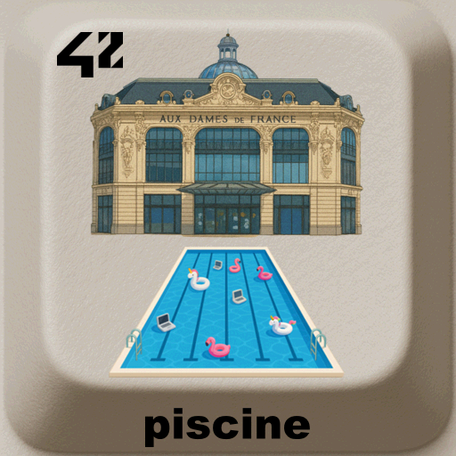

# piscine-42

  <h2>Piscine 42 – École 42</h2>
  
   

> The **Piscine 42** is the legendary **selection and initiation bootcamp** of École 42.  
> A month-long immersion into **C programming, algorithms, and UNIX**, designed to test resilience, adaptability, and teamwork.

---

## 📖 Table of Contents
- [Description](#-description)
- [Daily Life](#-daily-life)
- [Skills Acquired](#-skills-acquired)
- [Challenges](#-challenges)
- [Tips for Survival](#-tips-for-survival)
- [Credits](#-credits)
- [License](#-license)

---

## 📝 Description
The **Piscine** (French for *swimming pool*) is a **four-week intensive program** where candidates dive into the fundamentals of computer science with no prior prerequisites.  
It is a rite of passage to be admitted as a full student at **42**.  

During the Piscine, you:  
- Code **every day, including weekends**.  
- Work mainly in **C and Bash**.  
- Collaborate and compete with peers.  
- Learn by **peer-to-peer correction** (no teachers).

I'm sharing here the files projects I did manage to close

---

## ⏳ Daily Life
- Morning → Projects to complete.  
- Daytime → Peer learning, debugging, group problem-solving.  
- Evening → Evaluations, corrections, and late-night coding marathons.  
- Weekend → Exams and new challenges like rushes.  

---

## 🛠 Skills Acquired
- Mastering the **UNIX shell**.  
- Writing **C programs** from scratch (loops, pointers, memory allocation).  
- Understanding **algorithms** and efficiency.  
- Practicing **Git** and version control.  
- Developing **team spirit** and **autonomy**.  

---

## 💥 Challenges
Some emblematic projects of the Piscine: 
- `ft_atoi_base` → Converts a string from a specified base (up to base 16) into a decimal integer.  
- `ft_split` →  Split a string into an array of words.  
- `rushes` → Group weekend projects.  
- `exams` → Timed coding challenges every week.  

---

## 🏊 Tips for Survival
- Sleep is important, but so is persistence.  
- Learn to **Google efficiently**.  
- Don’t be afraid to ask for help (and to give it back).  
- Work **daily**: skipping even one day will make it harder.  
- Remember: **teamwork** is as important as your own code.  

---

## 👤 Credits
This README was prepared by **Loïc Gérard** – student at [École 42 Perpignan](https://42perpignan.fr).  

---

## 📜 License
This project and its documentation are under the MIT License – see the [LICENSE](./LICENSE) file for details.  

> ⚠️ Note: The Piscine is about **learning by doing**.  
> Do not copy others’ work blindly — dive, struggle, and you’ll learn to swim.  
